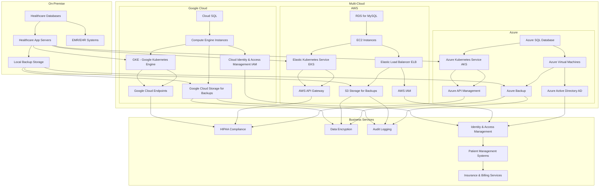

```mermaid
graph TD
  %% On-premise infrastructure
  subgraph On-Premise
    A[Healthcare Databases] --> B[Healthcare App Servers]
    A --> C[EMR/EHR Systems]
    B --> D[Local Backup Storage]
  end

  %% Cloud infrastructure for multi-cloud architecture
  subgraph Multi-Cloud
    direction TB

    %% Azure cloud services
    subgraph Azure
      E[Azure SQL Database] --> F[Azure Virtual Machines]
      E --> G[Azure Kubernetes Service AKS]
      G --> H[Azure API Management]
      F --> I[Azure Active Directory AD]
      F --> J[Azure Backup]
    end

    %% AWS cloud services
    subgraph AWS
      K[RDS for MySQL] --> L[EC2 Instances]
      L --> M[Elastic Kubernetes Service EKS]
      L --> N[Elastic Load Balancer ELB]
      M --> O[AWS API Gateway]
      N --> P[AWS IAM]
      N --> Q[S3 Storage for Backups]
    end

    %% Google Cloud services
    subgraph Google Cloud
      R[Cloud SQL] --> S[Compute Engine Instances]
      S --> T[GKE - Google Kubernetes Engine]
      T --> U[Google Cloud Endpoints]
      S --> V[Cloud Identity & Access Management IAM]
      S --> W[Google Cloud Storage for Backups]
    end
  end

  %% Business services common in healthcare industry
  subgraph Business Services
    direction LR
    X[HIPAA Compliance]
    Y[Data Encryption]
    Z[Audit Logging]
    AA[Identity & Access Management]
    AB[Patient Management Systems]
    AC[Insurance & Billing Services]
  end

  %% Connections between on-premise, cloud, and business services
  B --> G
  B --> M
  B --> T
  D --> J
  D --> Q
  D --> W

  G --> H
  M --> O
  T --> U

  H --> X
  O --> X
  U --> X

  I --> AA
  P --> AA
  V --> AA

  J --> Y
  Q --> Y
  W --> Y

  J --> Z
  Q --> Z
  W --> Z

  AA --> AB
  AB --> AC
```
